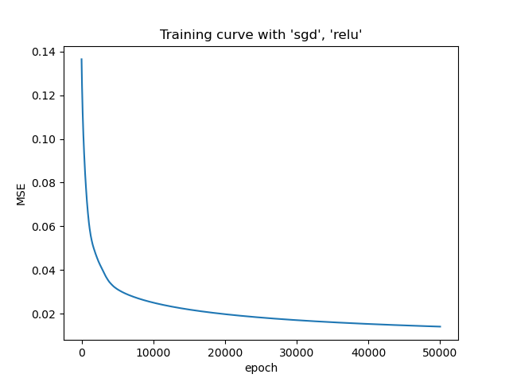
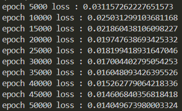

# DLP Lab1 - Backpropagation

---

## Introduction

### Forward propagation

本次作業需要從0開始實作Neural Network的Forward propagation和Backward propagation，並設計一個兩層hidden layers的神經網路進行二元分類問題，主要能辨別線性的資料分布與互斥或(XOR)的資料分布，將預測結果、訓練損失數據可視化。前向傳播的過程中需要考慮到權重矩陣維度的對齊以及激活函數的正確性，最終與Ground True計算MSE損失函數來評估預測準確度。

### Backward propagation

反向傳播需要考量到每一層前向傳播的結果，因此在前向傳播時就必須要記住當時的輸出與權重，並且透過Chain Rule去計算每一層每一個節點的梯度，得到每一個點的梯度後便可以用優化器來對整體網路的權重進行優化。

---

## Experiment setups

### Sigmoid functions

Sigmoid函數為常見的激活函數，目的是將輸入的值投射到0~1的區間內，通常適合用於二元分類的資料分布，函數圖形如下：

||||
|:---:|:---:|:---:|
| **sigmoid function**  | **forward** | **backward** |

### Neural Network

主要分為：輸入層、隱藏層x2、輸出層，每一層的節點都必須包含線性轉換加上激活函數，最終通過輸出節點得到最終的預測機率，並與Ground True計算Mean Square Error

||
|:---:|
|**Neural Network design**|

### Backpropagation

反向傳播用來算每一個節點的梯度，使用Chain Rule來將當前的梯度往前傳使得前面層數的節點也能得到梯度，而計算當前節點時也會使用到當下的輸出跟權重：

||
|:---:|
|**Backpropagation design**|
---

## Results of testing

比較兩者的訓練損失曲線可以發現線性資料的曲線下降比較快，原因是線性的資料比較適合用於二元分類資料。

### Linear data

|||
|:---:|:---:|
|**Results**|**Performance**|
| ||
|**Loss Curve**|**Training Loss**|

### XOR data

|||
|:---:|:---:|
|**Results**|**Performance**|
| ||
|**Loss Curve**|**Training Loss**|

---

## Discussion

### Try different learning rates

在這個實驗之中，可以看到不管Learning rate怎麼調整，只要越接近1收斂的速度就越快，且擺盪的情況很少，代表本次資料的分布簡單容易讓模型學習。

#### Linear data

||||
|:---:|:---:|:---:|
|**learning rate=0.001**|**learning rate=0.1**|**learning rate=1**|

#### XOR data

||||
|:---:|:---:|:---:|
|**learning rate=0.001**|**learning rate=0.1**|**learning rate=1**|

### Try different numbers of hidden units

在這個實驗中可以發現，當hidden layer中的hidden unit越少時，收斂的速度就越慢、越需要訓練更多的epoch來達到收斂，且這個現象在XOR data中比Linear data還要明顯，原因跟上述一樣因為XOR比較不適合做二元分類因此要更長的收斂時間。

#### Linear data

||||
|:---:|:---:|:---:|
|**[2, 3, 3, 1]**|**[2, 7, 7, 1]**|**[2, 16, 16, 1]**|

#### XOR data

||||
|:---:|:---:|:---:|
|**[2, 3, 3, 1]**|**[2, 7, 7, 1]**|**[2, 16, 16, 1]**|

### Try without activation functions

從這個實驗中可以觀察到，激活函數對於線性資料沒有影響，原因可能是線性的投射本身就適合分類線性分布的資料，但是在XOR資料上，少了激活函數的非線性投射，影響非常嚴重。

#### Linear data

|||
|:---:|:---:|
|**Prediction**|**Loss Curve**|

#### XOR data

|||
|:---:|:---:|
|**Prediction**|**Loss Curve**|

---

## Extra

### Implement different optimizers

#### Linear Data

|||
|:---:|:---:|
|**SGD**|**Momentum**|

#### XOR Data

|||
|:---:|:---:|
|**SGD**|**Momentum**|

### Implement different activation functions

在這個實驗中，可以觀察到tanh函數在XOR上有較平滑的訓練損失曲線，在線性則較不平滑，但是實際上並沒有太影響到收斂的速度跟準度。

#### Linear Data

|||
|:---:|:---:|
|**ReLU**|**tanh**|

#### XOR Data

|||
|:---:|:---:|
|**ReLU**|**tanh**|