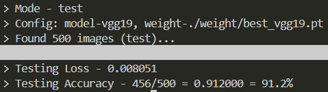
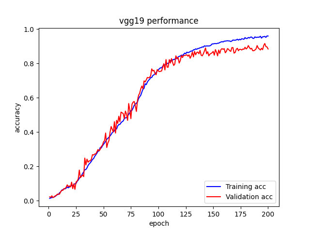

# DLP Lab2 - Butterfly & Moth Classification

---

## Introduction

在本次的 Lab 中，我們需要使用 VGG19, Resnet50 兩個架構來對蝴蝶與蛾來進行分類，在本次作業中需要熟悉自己使用 Pytorch 套件架設網路架構，並且自己建立 Custom dataset 類別來讀取影像資料，

## Implementation Details

在這邊先說明兩架構都與參考資料及論文不同，在最後沒有加入 `Sofrmax` 當作最終的機率輸出，原因是加入後會導致訓練非常緩慢，因此沒有加，但不影響到整理模型的 Performance，因為線性層輸出還是能夠當成機率來做預測。

### VGG19

VGG19 主要由 5 個 block 組成，每一個 block 都有不同數量的 convolution layer，在我的 VGG19 網路中，我將每一個 Convolution layer 都定義為由 `Conv2d`+`BatchNormalize`+`ReLU` 組成，在程式碼中是用類別中的方法 `_build_layer`實現，主要功用是將 Convolution layer 以特定的數量堆疊起來，最後再接上一層 `MaxPool2d`，完成一個 block 的堆疊。在網路的最後接上 Linear layer 當作 Prediction head，輸出為類別的數量，這邊設置為 `num_classes=100`。

|  |
|           :---:          |
|          VGG19架構       |

### ResNet50

在 ResNet 會有 5 個 stage，而 ResNet50 的每個 stage 都由 Bottleneck block 堆疊而成，Bottleneck block 是由 3 組的 `Conv2d`+`BatchNormalize`+`ReLU` 組成，其中只有中間的 Convolution layer 為 `kernel=3`，其餘兩層皆為 `kernel=1`，在這邊若是需要用到 down-sampling 則會將輸入分岔出去接一層 Convolution layer 到輸出來實現。而在最後也是接 Linear layer 來當作 Prediction head，輸出為 `num_classes=100` 的類別機率。

|  |  |
|                :---:              |               :---:             |
|          Bottleneck block         |            Resnet50架構         |

### Dataloader

在處理 Dataset 讀取的部分，統一以類別 `DataHandler` 處理，可以呼叫 `get_dataset` 得到我們指定的資料集 (這邊是lab指定的`'ButterflyMoth'`)，得到這個資料集後再呼叫 `get_dataloader`，來得到 `torch` 中處理資料讀取的 API `DataLoader`，呼叫時需要將得到的 `dataset`, `batch_size`, `num_workers` 一起輸入。

|  |
|               :---:               |
|             DataHandler           |

## Data Preprocessing

在訓練資料的資料前處理中，為了使模型對於不同分布的資料有更好的分類能力，在讀取訓練資料時有透過 `torchvision.transform.v2` 引入許多的資料處理功能，首先會隨機的對圖片進行`RandomRotation`、`RandomHorizontalFlip`、`RandomVerticalFlip`，這能使模型考慮更多的拍攝角度作為訓練樣本，而對於光線變化、雜訊等干擾，透過 `ColorJitter` 調整色調與亮暗使模型對於不同色彩、晝夜變化等有更好的學習能力。最後會轉成模型可以吃的型態，再經過 `Normalize` 得到最終的輸入。而驗證集與測試集的部分就不需要做資料增強的前處理，只需要將其轉為模型可以吃的模式即可，且若訓練集有做 `Normalize` 的話這邊也要做。

| |
|              :---:              |
|        Data Preprocessing       |

## Experimental results

### Model performance

|||
|            :---:             |                :---:               |
|   VGG19 Performance (acc=0.912)   |  Resnet50 Performance (acc=0.952)  |

### Training accuracy

在訓練時，VGG19 花費的時間約莫等於 ResNet50 的兩倍，而所需要達到收斂的 epoch 數也為 ResNet50 的兩倍之多，但是準確度卻不及 ResNet50，透過這次的比較，可以看出 ResNet50 架構的強大之處，不僅收斂速度快、梯度穩定、避免梯度消失，在準確度上也略勝一籌。從下表中可以看到，即使 VGG19 訓練的 epoch 數是 ResNet50 的兩倍仍然還未收斂，且模型比 ResNet50 大上許多，這也是 VGG19 現在比較少人使用的原因之一。

|||
|                :---:                |                    :---:                   |
|    VGG19 Training Accuracy Curve    |       Resnet50 Training Accuracy Curve     |

## Discussion

在訓練 VGG19 時有發現，一開始根據原始的論文架構下去做訓練，有發現不管練到多久的 epoch，準確度使中升不上來，再經過一番的查詢、翻閱資料時，發現在 `Conv2d` 與 `ReLU` 之間加入 `BatchNormalize` 時能夠使模型有效的訓練，原因是 batch 的正規化可以穩定模型在不同的 batch 時的梯度表現，正規化之前的 batch 是隨機性高的資料，因此算梯度時也會受影響，但是正規化到均值為 0，變異數為 1 的資料後，則可以達到較穩定資料訊息，因此即使是不同 batch 都可以有穩定的更新權重。
