# DLP Lab3 - Binary Semantic Segmentation

---

## Overview

在本次 Lab 中，我們需要建立兩種網路模型來完成影像分割的任務：(1) UNet, (2) Resnet34 + Unet，分別是基本的 Unet 架構以及把 encoder 換成 Resnet34 的版本。

|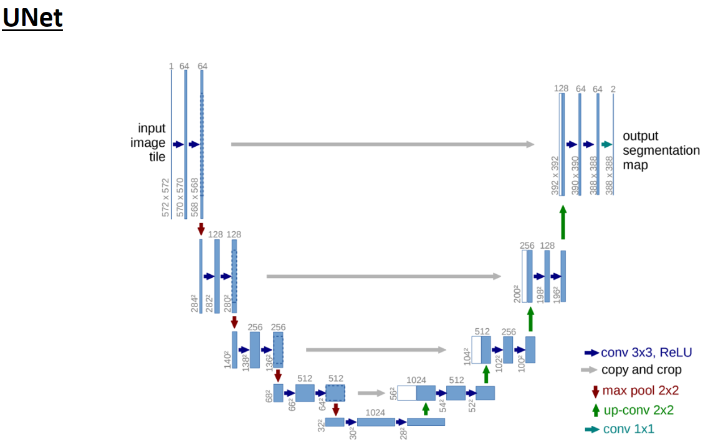|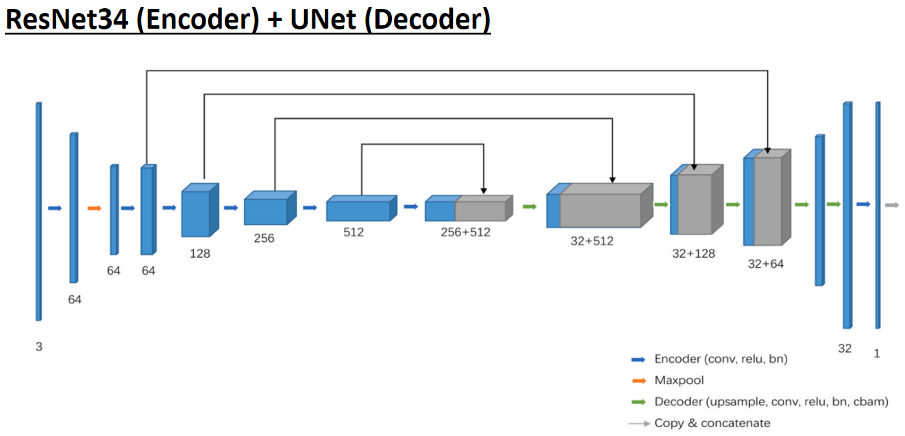|
|:---:|:---:|
| **UNet**  | **Resnet34 + Unet** |

U-Net在分割任務上扮演很重要的角色，因為 down-sampling + up-sampling 的架構給予模型能夠從不同的 scale 來去學習影像細部的內容，而本次 Lab 要我們在 Oxford-IIIT Pet Dataset 上完成影像分割任務。Oxford-IIIT Pet Dataset 是一個常用於 Semantic Segmentation 和 Object Segmentation 的 Benchmark，包含 7349 張寵物的圖片(大多數是狗和貓)，我們需要以此資料集訓練並評估模型，最終用 DICE score 來衡量好壞。

$$ Dice\ score=\frac{2\times Intersection}{Pred\ mask + GT\ mask} $$

---

## Implemtation Details

### Details of training code

一開始在訓練時一直有 DICE score 升不上去的情況，後來是發現在計算整個 epoch 的分數時，應該要除以的不是資料集長度，而是 batch 的個數，這點是與前面幾次作業較不同的地方，其餘的訓練細節為：

- 使用 `Adam` 做為 optimizer，learning rate 預設為 `lr=1e-5`
- 我的配置為：`batch_size=16`, `num_workers=8`, `epochs=100`
- 每一個 epoch 都會進行驗證得到 `val_loss`, `val_acc`
- Loss Function 只有單純使用 DICE Loss，且 Accuracy 與 Loss 的和為 1
- 得到更好的驗證分數就會儲存模型，也能透過設置 interval 來儲存 checkpoint 與 weight

### Details of UNet & ResNet34_UNet

#### UNet

|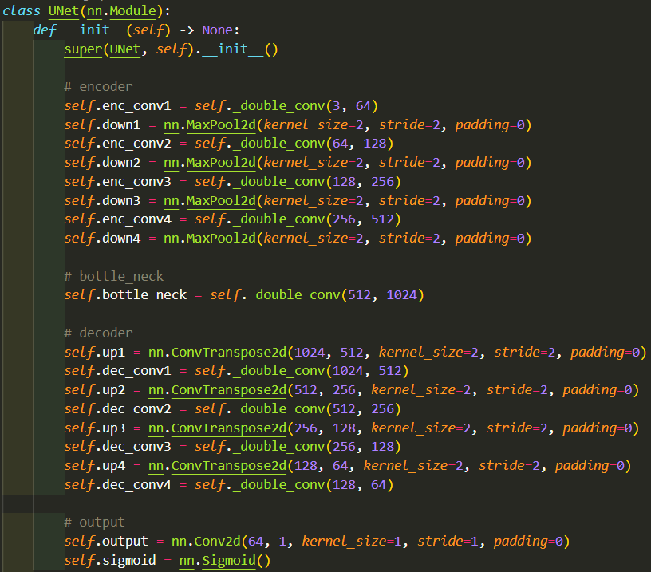|
|------------------|
| Unet 主要由 Encoder, Bottleneck, Decoder 組成，Down-sampling 的部分我參照原始論文的方法，使用 `MaxPool2d` 來完成，而 Up-sampling 則使用 `ConvTranspose2d` 來實現，其中在 `_double_conv`內是由，兩組的 `Conv2d` + `BatchNorm2d` + `ReLU` 組成，在 Convolution 的設定上有加入 `padding=1` 避免在 skip-connection 的地方還需要做額外的 crop 以減少運算量。在輸出層的部分，因為考慮到我們要得到預測出來的 binary mask，所以輸出維度為1的 prediction mask ，再經過 `sigmoid` 得到最終每個 pixel 的機率值。 |

#### ResNet34_UNet

|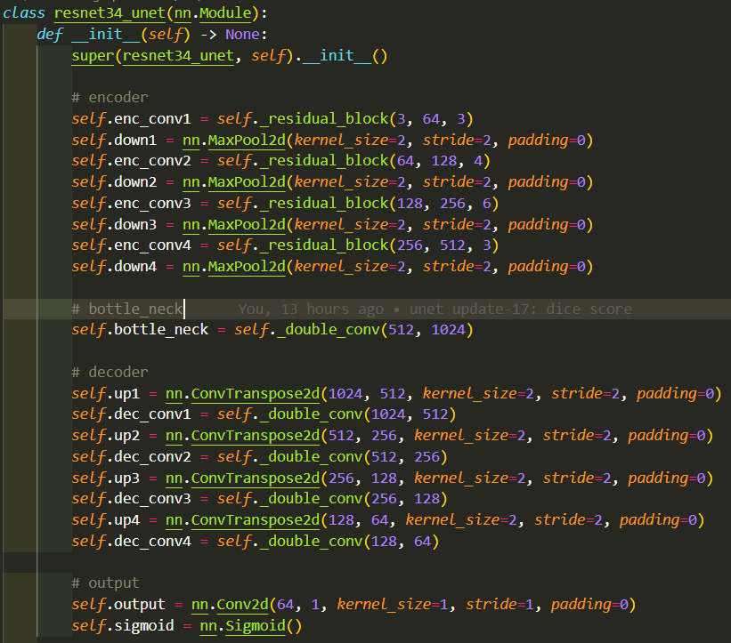|
|------------------|
| Resnet34_Unet 是由 Unet 改過來的，主要是把 Down-sampling 的過過程由 Resnet34 取代，因此原本的 `_double_conv` 以 `_residual_block` 取代，每一個 Convolution Layer 都由 `Conv2d` + `BatchNorm2d` + `ReLU` 實現，除了層數外沒有變動太多，沒有變動太多的原因是原本提供的參考資料模型參數明顯下降許多，我不想要參數下降而導致模型可能失去準確度，因此 Up-sampling 的過程仍然是保持原本 UNet 的通道數。 |

---

## Data Preprocessing

在資料前處理的過程中，我主要提供兩種不同處理方式的資料集，分別為簡單 Resize 的資料以及有做些許資料增強的資料集。在實驗結果分析中，會比較兩種不同資料集的表現。

### Simple Oxford Pet Dataset

|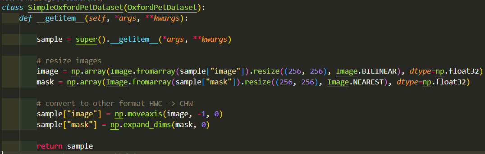|
|----------------------|
| 與助教提供的範例程式碼沒有做太大的修改，只有保留 `image`, `mask` 兩種形式的資料當成模型的輸入資料與標籤資料，輸入前都會 Resize 成 256x256，以避免模型在 sampling 的過程中因為尺寸問題導致有 pixel 被吃掉。|

### Data Augmentation Oxford Pet Dataset

|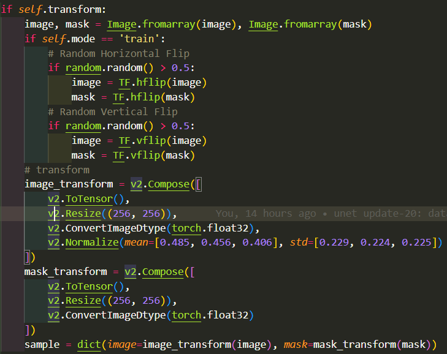|
|----------------------|
| 在另一個資料集中，由於考慮到 image 與 mask 要做相同的 transform，我只有做一些簡單的資料增強，如水平翻轉、垂直翻轉等(`TF=torchvision.transforms.functional`)，另外正規化只會對 image 做而不會對 binary mask 做，以防在計算DICE Loss 時遇到值域跑掉的問題。|

---

## Analysis on the experiment results

### Training & validation stage

下圖為訓練階段時，兩個模型分別在有無資料集增強的方式下得到的 training & validation curve，綜觀而言，可以看到兩者在 Training 上的 DICE score 沒有太大的差距，但是在 Validation 上有資料增強的模型 DICE score 略高出一點，這樣的表現是可想而知的，因為訓練階段只會看到訓練集，無法學到比更複雜的情況，因此沒有資料增強的模型在驗證階段會比較低分。不過當 epoch 數越來越往上時，兩者的差異也越來越小，我認為有可能是資料集單純，因此模型最終會學到的東西趨近一致，若是在更複雜的資料集，兩者的表現差異會更明顯。

#### Simple dataset

|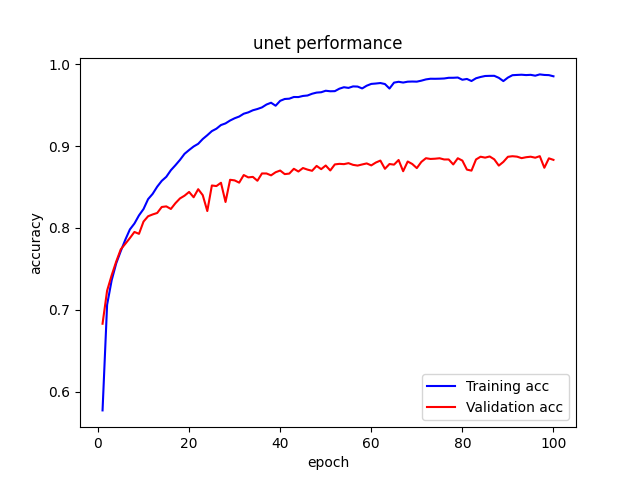|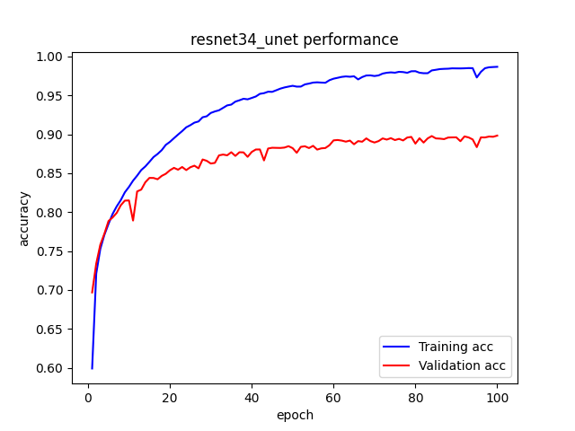|
|:---: |     :---:     |
| UNet | Resnet34_UNet |

#### Data Augmentation dataset

|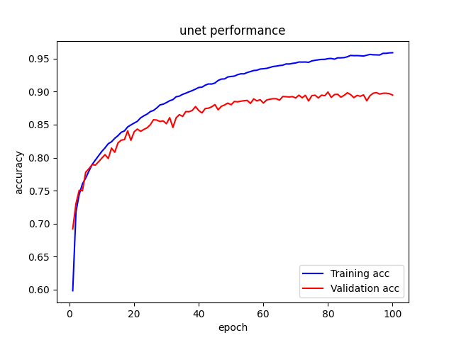|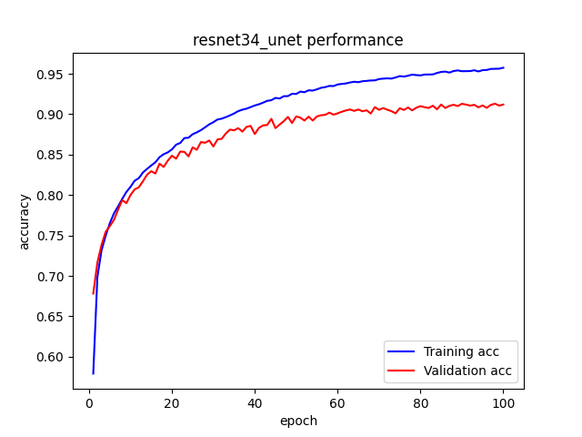|
|:---: |     :---:     |
| UNet | Resnet34_UNet |

### Inference stage

前面有提到訓練資料的增強可以使模型在沒看過的資料上有更好的表現，下列圖表為四個模型在測試資料上的表現，可以看出以 UNet 為架構的模型，加入資料集增強後 DICE score 從 0.882 提升到 0.891，而以 Resnet34-Unet 為架構的模型則從 0.892 提升到 0.904，這個實驗證明資料集增強是有效的。

#### Simple dataset

|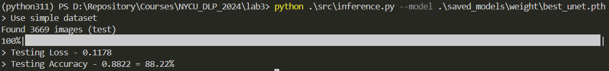|
|             :---:         |
|      UNet (DICE=0.882)    |
| 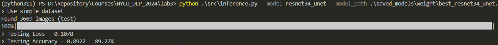|
| Resnet34_UNet (DICE=0.892) |

#### Data Augmentation dataset

|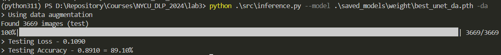|
|             :---:         |
|      UNet (DICE=0.891)    |
| 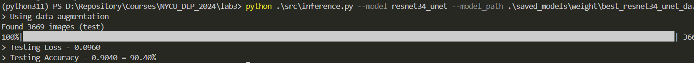|
| Resnet34_UNet (DICE=0.904) |

---

## Execution command

### Training

- `-da`很重要，這個參數決定是否使用 data augmentation
- `-cu`代表是否要使用 checkpoint 做訓練
- `--history`的用意是避免訓練中途斷掉無法重頭畫 loss & validation curve，加入此參數會從上次中斷的 epoch 開始訓練並保留之前的 loss
- 其餘的超參數可以自行根據機器調整，模型與對應的`.ckpt`要注意是否正確

```py
# basic command
python ./src/train.py --model unet         
                              resnet34_unet
# use checkpoint
python ./src/train.py --model unet -cu --ckpt_path <path/to/ckpt> # --history (if you want to keep the previous loss and start training from the last interrupted epoch)

# hyperparameter
python ./src/train.py --model unet --lr <learning rate> -b <batch size> -nw <workers> -d <device>

# data augmentation
python ./src/train.py --model unet -da
```

### Inference

- **請特別注意**：若要使用有 data augmentation 的模型，必須加入 `-da`，使模型讀取有增強過的資料。
- `model`為使用的模型，`model_path`則為對應的權重，兩者必須匹配
- `-sp`是決定是否要儲存模型預測的前10張影像

```py
# basic command
python ./src/inference.py --model unet --model_path <path/to/weight>
python ./src/inference.py --model unet --model_path <path/to/weight_da> -da

# saving prediction mask
python ./src/inference.py --model unet --model_path <path/to/weight> -sp
```

---

## Discussion

### Performence comparison

#### Network

從上面結果的篇章來看，可以很明顯地看到不管是在哪一個資料集，我的 Resnet34_UNet 都比 UNet 還要高，這是因為我在 Resnet34_UNet 中的 Up-sampling 過程沒有去降低維度，而是維持原本 UNet 的寫法，這也使得模型整體的參數更多，更多的參數可以學到更多的內容，因此表現當然會比較好。

#### Dataset

另外在資料集的部分，有做過資料增強的可以使模型學到更豐富的資訊，也使得在同一個架構下，以增強資料學習的模型有更好的表現。

### Potential research topics

從以上得到的結論我歸納出兩點可以研究的方向：

**1. 不同資料增強方式的影響**：若是對於不同性質的資料集，是否有符合該性質的增強方式，能夠使得模型有更好的表現，我想是很值得研究的，包含分析資料集特性、對應的增強方式等...。

**2. 模型大小與表現的平衡**：模型輕量化一直是模型落地的目標之一，如何在模型大小與表現上取得平衡，也是未來可以探討的方向。

---

## Prediction Results

### Unet - Simple dataset

|||
|             ---         | --- |
|||

### Unet - Data Augmentation

|||
|--- | ---|
|||

### Resnet34 + Unet - Simple dataset

|||
|             ---         | --- |
|||

### Resnet34 + Unet - Data Augmentation

|||
|--- | ---|
|||