# DLP Lab4 - Conditional VAE Video Prediction

---

## Derivate CVAE formula

> picture

## Introduction

- **Video Prediction**
  
    本次實驗中，我們會使用 Conditional VAE 以人體骨架為條件對後續的 frame 進行預測，首先要預測 Training set 中人物圖像與骨架的 Predictor，盡可能的使資料中的分布(Posterior distribution) 逼近 Normal Gaussion(Prior distribution)，得到資料集的分布之後，再訓練 Generator 以骨架姿態與前次的預測結果為條件，從分布中採樣產生下一個 frame。

- **Teacher forcing**

    Teacher-Forcing 是在處理時序資料時，將 generator 輸入由前一個 time step 預測值改為 Ground True，避免序列生成的過程誤差逐漸放大，可以幫助模型加速收斂和增加穩定性。不過可能遇到 **Exposure Bias** 的問題，即 training stage 約束過重導致 inference stage 是從不同的分布中生成圖片，使得兩個階段之間有 gap 存在。因此本次實驗參考 2015 年 Google 發表的論文《Scheduled Sampling for Sequence Prediction with Recurrent Neural Networks》的方式，在模型每一個 time steps 給定機率 $p$ 來選擇是否使用 teacher forcing，$(1-p)$ 機率來使用原本的 Autoregressive。

- **KL-annealing**

    在 VAE 訓練的過程中，為了最大化 reconstruction term 並最小化 KL-divergence term，很容易造成 KL-vanishing (posterior collapse) 的問題，這會使得 latent space distribution 直接與輸入 x 無關(因為最小化 KL-divergence 只需使得 posterior = prior)，也這會使得我們的 decoder 能力放大而不需仰賴 latent space distribution。因此為解決這項問題，需要使用 KL-annealing 循環或線性的調整 KL-divergence term 的係數，保證模型有多一點的時間學習輸入 x 的資訊到 latent space distribution 中。

---

## Implementation details

### Training protocol

**Setting**: 第一階段先對每個參數調整並且比較 PSNR 結果，每個實驗都進行 100 epoch 的訓練，初始 `learning rate=0.001`，分別在 epoch=2, 20, 80 時降低10倍，learning rate 必須要降的足夠低才不會在沒使用 Teacher forcing 時遇到 Gradient explosion，得到最好的參數後，第二階段使用最好的參數進行 200 epoch 的訓練，初始 `learning rate=0.001`，分別在 epoch=2, 20, 80, 100 時降低10倍，以期望達到最好的收斂結果。最終我也好奇更多的 epoch 是否存在更好的收斂結果，使用同樣的 learning rate decay strategy 持續訓練到 400 epoch。所有階段都是使用 Adam 進行優化，Loss 為 MSE Loss + KL divergence，Batch size 為 4。

### Reparameterization tricks

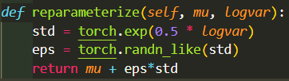

重參數化的技巧是假設 prior distribition 是 Normal Gaussian ~ $N(\mu,\sigma)$，因此可以將 latent space 以 $z=\mu+\sigma\epsilon$ 表示，則使得分布與網路參數分布無關，使其可以計算 Gradient。 

### Teacher forcing strategy

**以 `KL-annealing=Cyclical, ratio=0.1`、Linear decent ratio 的設定訓練 100 epoch**，實驗 Teacher forcing ratio 的在哪種設定下在 validation set 上會有比較好的 average PSNR，同時比較各種設定的 average Loss，證明 Conditional VAE 的 Training Loss 越低不一定會有越好的結果。

首先，我們比較感興趣的是 Teacher forcing ratio 降低的速度對於 PSNR 的影響，因此以下列 3 種降低速度：10 epoch, 50 epoch, 100 epoch 觀察降低速度對模型表現的影響。從下列表格可以觀察到模型在整個訓練期間慢慢遞減 Teacher forcing ratio 在 validation set 有最好的 PSNR。另外，我也測試 fixed Teacher forcing ratio 是否會比 Linear decay 表現還要佳，因此在 10 epoch 後將 ratio 設定在 0.5，相等於模型隨機啟動 Teacher forcing，結果如下：

| Decent epoch | avg. PSNR | avg. Loss | 
|:-----------: |:---------:|:---------:| 
|      10      |   19.65   |    0.05   | 
|      50      |   18.24   |  **0.04** | 
|     100      |  *22.37*  |    0.05   | 
|  fix at 0.5  | **24.50** |    0.05   | 

可以觀察到模型隨機啟動 Teacher forcing 有最好的結果，其次是將 decay ratio 設定在 0.02 (decay 100 epoch)，我認為這樣的現象是因為在 Video Prediction 等序列資料預測的任務上，中途的監督訊號是非常重要的，中間的監督訊號可以防止 latent distribution 與 prior distribution 越來越遠造成 Generator 採樣時的誤差而影響 PSNR。

### KL annealing ratio

在訓練的途中，Loss 中的 KL-divergence term 除了需要最小化也需要隱含訓練資料中的分布，若是永遠都考慮到 KL-divergence term 時，很容易造成 Latent space distribution 與輸入資料無關，因此需要在訓練過程中加入調整 KL-divergence term 的權重來降低訓練過程過度優化分布的情況。

共有兩種 KL annealing ratio 調整的方法，Monotonic 是為了讓模型有更長的時間將訓練資料分布學起來，之後就將 ratio 固定為 1，而 Cyclical 則是循環的更新 ratio。因此我測試不同 period 讓模型有不同的時間學習訓練資料分布，預期有越長的學習時間(period)會有更好的結果，以下分別以兩種 annealing 測試 `period=10, 20` 的結果:

|     Period    | avg. PSNR | avg. Loss | 
| :-----------: |:---------:|:---------:| 
| Monotonic/10  |   22.65   |    0.43   | 
| Monotonic/20  |   24.09   |    0.16   | 
| Cyclical/10   |   24.50   |   *0.05*  | 
| Cyclical/20   |  *27.68*  |  **0.04** | 
| w/o annealing | **28.35** |    0.64   |

可以觀察到在同一種 annealing 方式下，period 越長得到的 PSNR 越高與 Loss 越小，符合我的期待，同時我也好奇若是不使用 KL annealing 的結果，可以看出 PSNR 得到最高但因沒有考量訓練輸入資料的分布，因此 Loss 很高。

---

## Analysis & Discussion

### Teacher forcing ratio

下表為比較上述選擇 Teacher forcing ratio 的曲線，**以 `KL-annealing=Cyclical, ratio=0.1`、Linear decent ratio 的設定訓練 100 epoch** 產生的結果：

| decay ratio after 10 epoch | Tfr ratio curve | Training Loss curve |
|            :---:           |      :---:      |         :---:       |
|         decay by 0.1       | 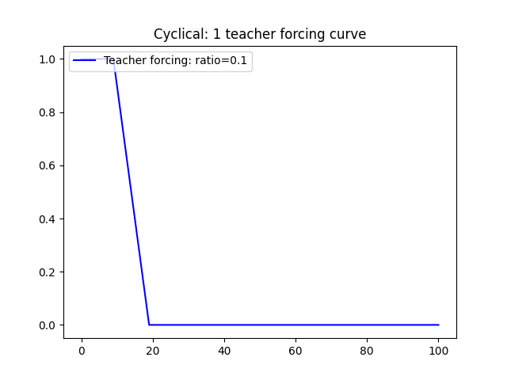 | 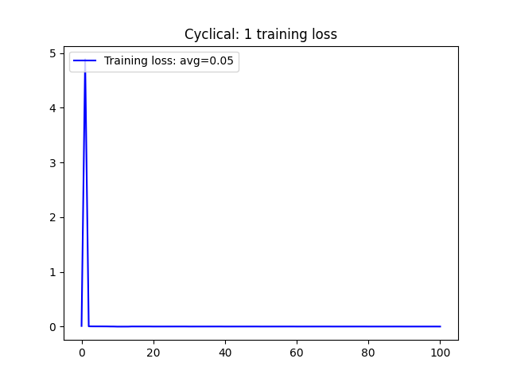 |
|         decay by 0.01      | 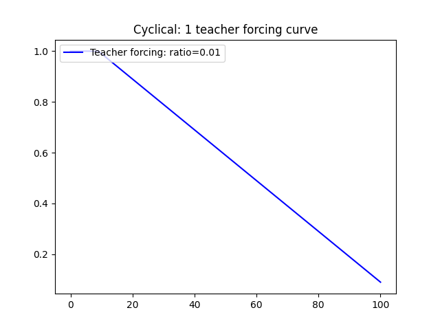| 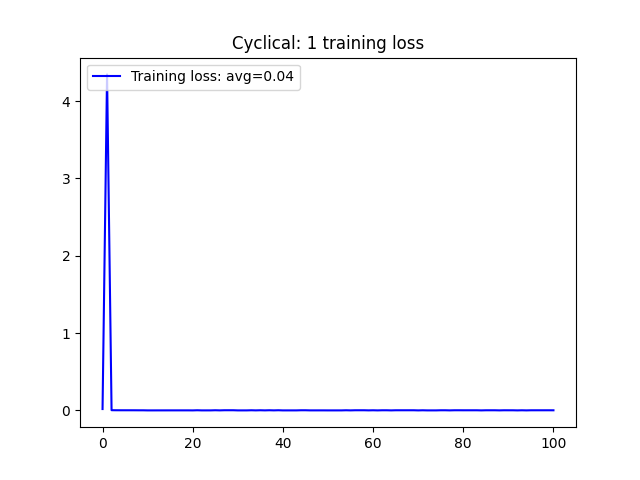|
|       ratio fix at 0.5     | 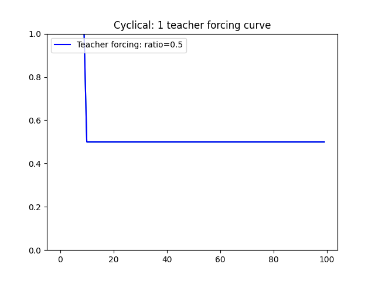 | 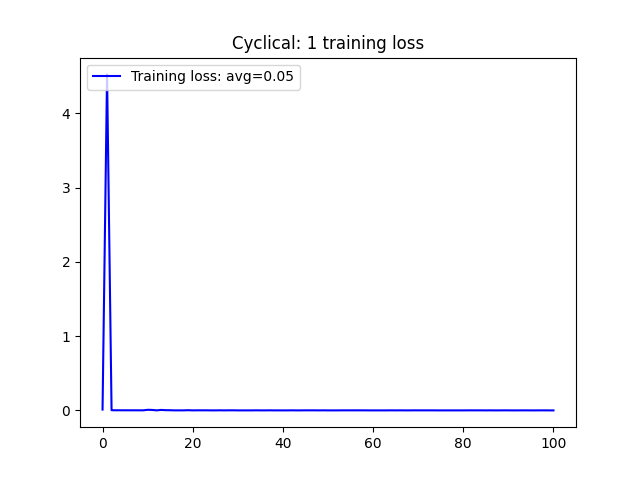 |

其實三種調整 Teacher forcing ratio 的策略在 average Loss 上差異不明顯，只有些微的 0.01 的 Loss 差異，那是因為 `ratio=0.01` 導致在整個訓練過程都有可能啟動 teacher forcing，所以可以一直提供監督訊號使 MSE Loss 穩定降低，average Loss 才會比另外兩者還要低。另外一點是前面兩者的訓練較穩定，不容易在前面幾個 epoch 出現 Gradient explosion，尤其是在 `epoch=11` 若是沒啟動 Teacher foring 就會 Gradient explosion，我猜測可能的原因為模型還沒學習好怎麼生成預測圖片，依照前次很差的結果繼續預測就越來越差最後就梯度爆炸了。

### Training loss curve

下表為使用不同的 KL-annealing strategy 所產生的 Loss curve，實驗方法都是將 beta 遞增週期設為 10 個 epoch，而 Teacher forcing ratio 是固定在 0.5，沒有使用 KL-annealing 的方法則是將 beta 固定在 1：

| 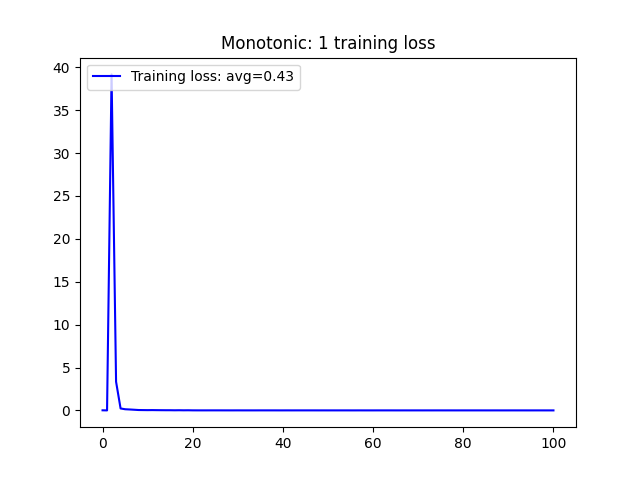 |  | 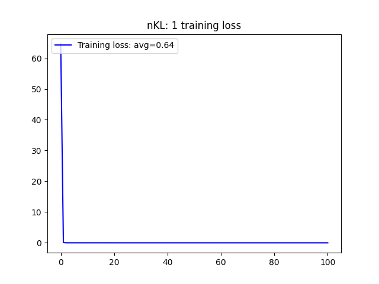 |
|   :---:   |   :---:  |      :---:      |
| Monotonic | Cyclical | No KL annealing |

可以觀察到 average Loss 最小的方式為 Cyclical，而最高的則是沒有使用 KL annealing，這明顯說明 KL-annealing 的重要性，只有當 latent distribution 有包含到輸入的分布時，才會有穩定的結果。

### PSNR-per frame in validation set

下列為各個 KL-annealing strategy 在 Teacher forcing ratio 固定在 0.5 的在 validation set 的 PSNR：

| 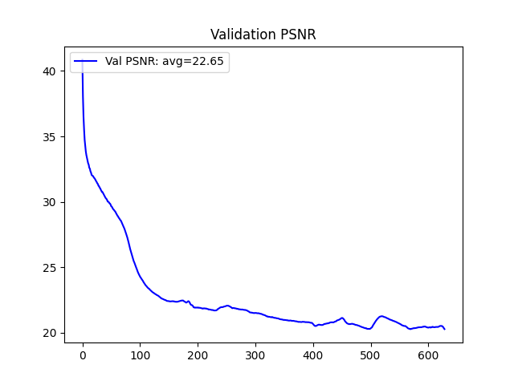 | 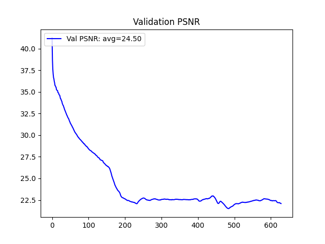 | 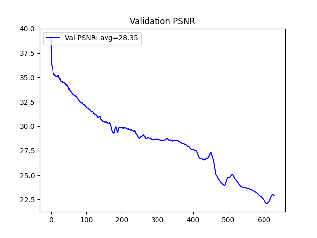 |
| :---: | :---: | :---: |
| Monotonic | Cyclical | No KL annealing |

在這邊可以觀察到沒有使用 KL-annealing 有比較好的 PSNR，我認為應該是因為在做 Generate 時，我們設定的 Latent space distribution prior 是 Normal Gaussian，而訓練時最小化 KL-divergence term 就將其逼近 Normal Gaussian，兩者是一致的分布情況，所以才會有這樣的結果。
