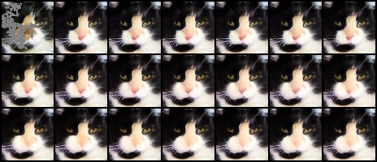
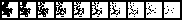

# DLP Lab5 - MaskGIT for Image Inpainting

---

## Introduction

MaskGIT 是 VQGAN 與 VQVAE 技術的續作，利用 Vector quantization 與 Masked Token 的技巧訓練生成式模型。因此以下會簡單介紹 VQVAE, VQGAN 的技巧：

### VQVAE: Vector Quantization

在 VAE Encoder 中是學習訓練資料特徵的機率分布得到平均與標準差，而 VAE Decoder 會從特徵機率分布中隨機採樣點進行圖片生成，這種從機率分布中採樣出離散點的過程，VQVAE 的作者認為或許可以直接在 latent space 學習出離散分布取代隨機採樣離散點的方法。

作者在 latent space 中建立 codebook 儲存離散分布的 latent vector，在 Encode 後得到的連續分布 latent vector 與離散分布中的 latent vector 計算最短距離，將其轉為離散形式的特徵分布表示，最後再送進 Decoder 解碼出正確的預測值。

### VQGAN: Autoregression

VQGAN 則是在 Loss function 上加入對抗損失以及把原本的 MSE Loss 改為 Perceptual Loss，讓模型學得更好，除此之外也引入 Autoregressive model: Transformer，作為第二階段的訓練，這個想法是引用 NLP 領域補齊 masked token 的方法，這邊則是把 visual data 視為 visual token 進行預測。

### MaskGIT: Bidirectional Encoder Representations from Transformers

MaskGIT 進一步改善 VQGAN 的 performance，將 Autoregressive model 換成 BERT，並且引入 Masked Visual Token Modeling 的訓練技巧，使用 gamma function 對 token 進行遮掩，模擬任何可能發生的遮蔽情況，並且在 inferance stage 我們能一步一步的對模型進行 decoding，根據 masking schedule 慢慢的減少遮蔽的 token，逐步產出生成圖像。

---

## Implementation Details

### Multi-Head Attention

多頭注意力機制是為了要讓模型用更多參數學習到不同的特徵表示，將輸入投射成 `num_head` 個維度為 `dim//num_head` 的特徵向量，各自算過自注意力機制後，concatenate 回原本的 shape，再經過 output weight 得到最後的輸出。

在實作上，為了提升效率可以直接將輸入 `shape=(N, d_model)` 的特徵向量投射成維度三倍的特徵向量 `shape=(N, 3*d_model)`，將其重新排列為 `shape=(batch, N, num_head, 3*d_head)`，為了使計算自注意機制時只會計算各自head內的相似度，要將 `num_head` 的維度調整到前面得到 `shape=(batch, num_head, N, 3*d_head)`，再把特徵向量拆分成 `q, k, v` 計算自注意力，在這邊有加入 `attn_drop=0.1` 來調整自注意力機制的 Dropout 機率來訓練參數。

| Multi-Head Attention implement |
|              :---:             |
|    |
|    |

### Stage2 training: Masked Visual Token Modeling

MaskGIT 在訓練 BERT 時會隨機取樣需要被 mask 的 pixel，我是讓模型在 uniform distribution 上面取樣隨機點做為topk要取的個數 `K` 做為需要保留的 token 數量，再從隨機生成的 sample matrix 取得排名前面 `K` 個的索引值生成 `mask` 做為遮罩(需要保留的部分為 `True` )，將 `mask` 為 `False` 的部分換為 `mask_token_id` 與保留的 token 一起輸入進 BERT 內進行預測，得到機率值後返回 training loop 與 Ground True 計算 Cross Entropy Loss，使用 Adam 進行權重的更新。

|    MVTM training implement    |
|              :---:            |
||
||

### Inpainting & Interative decoding

使用 MaskGIT 進行 Inpainting 的方法是進行 Interative decoding，剛開始會先將 testing image 輸入到 VQGAN encoder 取得 latent vector `z_indices`，再針對 latent vector 與 mask 進行迭代更新，其做法的 pipeline 為：

1. 根據輸入 `mask` ，將輸入 `z_indices` 不需保留的 token 換成 `mask_token_id` 輸入到 BERT 進行預測，並且取得預測最高的機率與對應的 token id `z_indices_predict_prob`, `z_indices_predict`
2. 在 gumbel distribution 上採樣更新 `z_indices_predict_prob` 得到 `confidence`，更新目的是為了避免 softmax 強者恆強、弱者恆弱的狀況，加上隨機採樣值可使得機率小的也有可能被選到
3. 將需要保留的 token 值設為 `torch.inf`，表示為不需要 mask 的位置(跟後面的演算法有關係)
4. 根據 mask scheduling，從 `step` 與 `total_iter` 得到的比值 `ratio` 輸入進 `self.gamma_func` 得到當前 step 還須保留的 masked token 比例，乘上總共的 masked token 數量 `N`，得到最終還需要 mask 的 token 數量 `n`
5. 利用 topK 取得 `confidence` 最小的第 `n` 個 token 的信心值，利用其數值判斷小於此數值的 token 得到 `mask_bc`
6. 更新 `z_indices_predict`
7. 迭代 1. ~ 6.，直到 step 到達設定的上限

|  Interative decoding implement  |
|               :---:             |
||

---

## Experimental results

### The best result

- **Best Fid score**: 39.39
- **Training strayegy**
  - `epoch`: 60 without warm-up
  - `batch size`: 24
  - `learning rate`: 1e-4
  - `attn_drop`: 0.1
  - `optimizer`: Adam with $\beta=(0.9, 0.96)$
  - `scheduler`: ReduceLROnPlateau with reduce factor=0.1

- **Inpainting mask scheduling parameters**
  - `mask-func` : cosine
  - `sweet_spot`: 10
  - `total_iter`: 10

|     Generation     |        mask        |  Fid score  |
|    :----------:    |    :----------:    | :---------: |
||||

### Comparison figures with different mask scheduling

#### Iterative generation

|            |                consine             |                linear              |                square              |
|:----------:|             :----------:           |             :----------:           |             :----------:           |
| t=10, T=10 | |  |  |
| t=20, T=20 |  |  |  |
| t=30, T=30 |  |  |  |

#### Iterative mask

|            |                consine             |                linear              |                square              |
|:----------:|             :----------:           |             :----------:           |             :----------:           |
| t=10, T=10 |  |  |  |
| t=20, T=20 |  |  |  |
| t=30, T=30 |  |  |  |

## Discussion

### fid curve with different parameters

根據 MaskGIT 原始論文提出的實驗成果，指出 Iteration step (T) 在 7 ~ 8 之間有最低的 FiD score，之後會以接近線性的趨勢上升，因此在我的實驗中，我畫出 `gamma_func=cosine, linear, square` 的 FiD 趨勢圖，分別在 Iteration step 為 `t, T = 10/20/30` 時的 FiD score

與論文實驗相比，可以發現兩者有相同的趨勢，當 Iteration step 越高，FiD score 也越高。在我的觀點，我認為這是因為迭代的次數越多，相等於 gamma curve 上平均採樣越多的點，而採樣越多的點代表分布在 gamma curve 上 value 越低的採樣點越多，這代表保留的 masked token 數量越來越少，也意指我們能夠容忍信心程度越來越低的 token，因此隨著信心程度低的 token 增加，當然 FiD score 就會有往上的趨勢。

|           Gamma function curve          |              FiD curve             |
|   :---------------------------------:   |   :----------------------------:   |
|  |  |
