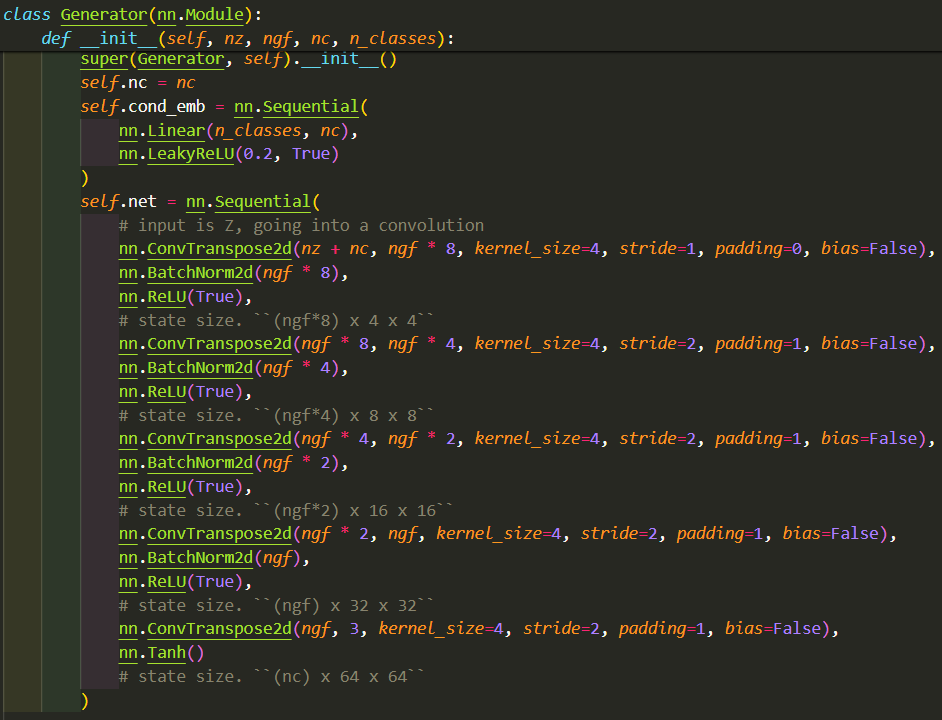
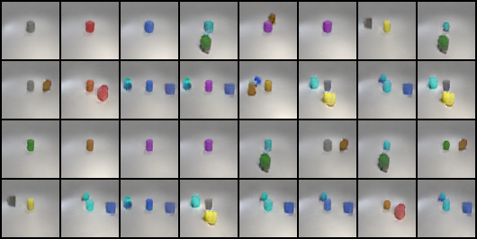
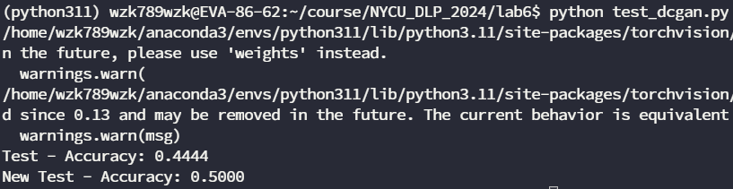

# DLP Lab6 - Generative Models

---

## Introduction

在本次作業中，需要實現 GAN 與 Diffusion model 兩種先後為主流的 Genrative AI model。GAN 主要是從 Gaussian noise 中一步生成圖像，透過對抗是的學習先是訓練 Discriminator 讓其能夠分辨真實影像與生成影像，再訓練 Generator 讓其生出更逼真更容易使 Discriminator 混淆的圖像。而 Diffusion model 則是逐步的加入 Gaussian Noise，為了保證最終的 timestep 為 Gaussian Noise，必須一次只加入一點點的雜訊，而在生成過程會是預測雜訊再做除噪，慢慢地往回採樣出生成圖像。

---

## Implementation details

在本次的作業中，我總共實作兩種 GAN: DCGAN 與 ACGAN，而 Diffusion model 是以最基礎的 DDPM 建構：

### DCGAN

DCGAN 由作者 Radford 等人在《Unsupervised Representation Learning With Deep Convolutional Generative Adversarial Networks》這篇論文中提出，在 Discriminator 與 Generator 中使用 Convolution layers 與 De-convolution layers，在 Gaussian Noise 中取樣 latent vector 輸入到 Generator 之中，生成出 RGB 影像，而 Discriminator 則是輸出是否為真實圖像的機率分布。下圖中的兩個 module 的輸入條件會經過 embedding layer，與 Input Image 進行 concatenate，再一起輸入到網路之中：

|  |  |
|:-----------------------------:|:-----------------------------:|
|           Generator           |         Discriminator         |

訓練的方法為上課簡報中的 pesudo code 提到的方法，在同一個 mini-batch 中，可以針對 Discriminator 訓練較多次，再訓練 Generator，因此我透過參數設定兩者的訓練比例，在最後的實驗章節會提到一些 ratio 調整上的比較。除了訓練次數不同外，我使用的是 soft label，只要在 0.7 ~ 1.0 的範圍就當作 True label，在 0.0 ~ 0.3 就當成 Fake label。最後也有在訓練 Discriminator 時，有一定的機率讓 True label 與 Fake label 交換，用於改善 discriminator 訓練太好的情況。

### Diffusion model

Diffusion model 使用 Unet 當作學習的網路，在 Unet 中 Encoder 與 Decoder 的每一個 scale 都會加入 timestep 與 condition 進行 embedding 後，condition 會與 input feature 進行內積後加上 timestep embedding，為了要讓 feature 與 condition 貼合所以使用內積， timestep 用加的是類似於 positional embedding 的作法。而在 DDPM forward process 與 backward process 上，如引言中所說，是逐步加入雜訊的過程，在訓練時是隨機生成雜訊與 timestep，進行預測當下的雜訊。在 backward process 是用下圖中的 sample function 來實現，是從 Gaussian Noise 逐步採樣預測雜訊的過程。

|  |       |
|:--------------------------------:|:--------------------------------:|
|            DDPM U-net            |            DDPM U-net            |

而 DDPM 需要先定義如何加入雜訊，以及 Beta 等參數，在此引用 `ddpm_scheduler` 來實現，在我的實驗中只有使用線性的方式加入雜訊：

||
|:-----------------------------------:|
|            DDPM scheduler           |

---

## Results and discussion

### Synthetic image grid

#### DCGAN results

||||
|:----------------------------:|:--------------------------------:|:---------------------------:|
|     Test set(acc=0.4722)     |     New test set(acc=0.4524)     |       Running results       |

#### Diffusion model results

|||
|:------------------------------:|:----------------------------------:|
|      Test set(acc=0.8194)      |      New test set(acc=0.8095)      |
| ||
|         Running results        |          Denoising process         |

### Pons and cons

我歸納出以下幾個面向來比較兩種模型：

- **訓練穩定度:** 就訓練穩定度而言，肯定是 Diffusion model 完勝，從理論上來說依小步驟的加入雜訊並且預測，比起直接從 Gaussian noise 生成圖像來的還要穩定，實作上我發現 GAN 的 Loss 參考的價值較低，並無法直接觀察出其與 Accuracy 的關係，且訓練 GAN 非常的不穩定，有時候 Accuracy 會很高，一下又會很低，需要額外的技巧幫助 GAN 模型有更穩定的訓練結果，例如 Discriminator 與 Generator 在 mini-batch 的訓練比例等等，在實驗中我進行訓練比例 1:1 與 3:1 (D:G) 的兩種設定，意外的發現 1:1 會有比較穩定的結果，時間上的考量沒有對 Generator 比較多的次數做訓練，但是應該會有更好的結果，因為通常 Discriminator 會有比較強的能力，生成會較難。

- **圖片品質:** 在我的實驗中，GAN 很容易生成出奇怪的物體，Diffusion model 頂多是沒有顏色或生錯誤體而很少有物體變型的情況。品質上是 Diffusion model 更好。

- **條件符合度:** 條件符合度是根據 condition 所指示要生成的物體，觀察結果兩者都沒有達到很好的吻合度，Diffusion model 略勝一籌，或許加入 classifier-guided 可以有效的改善這個問題，又或者將 DCGAN 改為 ACGAN 也能達到更吻合的條件，不過很有可能會犧牲圖片品質。

### Extra imexperiments

#### ACGAN

除了 spec 中建議的 DCGAN 以外，我也實作 ACGAN 作為模型訓練比較，

ACGAN 的方法類似於 Diffusion model 中的 classifier-guided，Discriminator 中除了原本的預測機率分布以外，還加入 classifier 來增加分類正確性，加強生成圖片與條件之間的連結性，我是基於 DCGAN 下去改動的，Generator 與 DCGAN 相同，但在 Discriminator 改動 Convolution 的 kernel size, stride 等，並且加入 Dropout 來訓練，在最後加入兩個網路：一個輸出機率分布、一個輸出類別機率，用於監督模型生出正確類別的圖。

|  |  |
|:-----------------------------:|:-----------------------------:|
|         Discriminator         |            Classifier         |

不過訓練時間需要很長的一段時間，因為時間的關係只有訓練 100 epoch，且模型的參數量較小，因此沒有達到預期的效果，反而比原本訓練很久的 DCGAN 還要來的差很多。

||||
|:----------------------------:|:--------------------------------:|:---------------------------:|
|      Test set(acc=0.1389)    |     New test set(acc=0.1429)     |       Running results       |